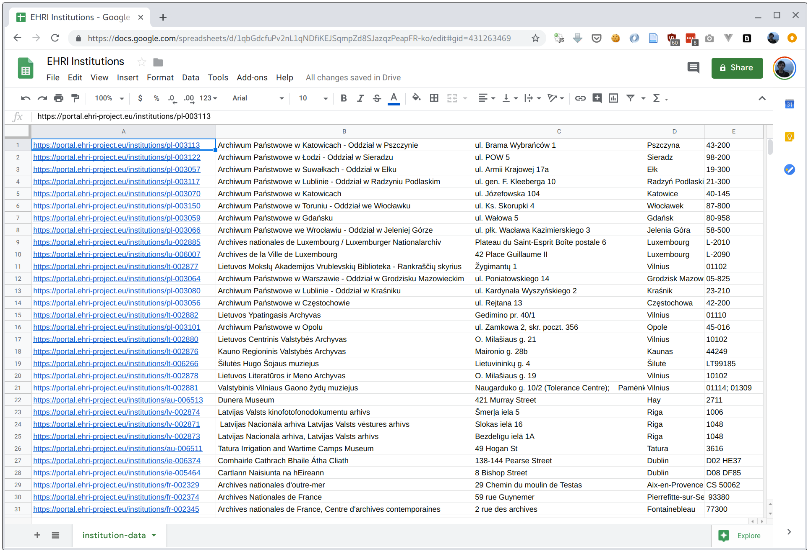

# Task 1: Fetching names and addresses of archival institutions

At the time of writing, EHRI has 2,167 archival institutions listed in the portal. In this first
task, we're going to use the API to fetch their portal URLs, names, and addresses.

To get started, lets investigate which of the Search API's three actions we'll need to fetch this
data.

Using CuRL, let's fetch the API description action, which shows us some basic info about the API.

```bash
curl https://portal.ehri-project.eu/api/v1
```

The data returned should look like this:

    {"meta":{"name":"EHRI API V1","routes":{"search":"http://portal.ehri-project.eu/api/v1/search?[q=Text Query]","fetch":"http://portal.ehri-project.eu/api/v1/ITEM-ID","search-in":"http://portal.ehri-project.eu/api/v1/ITEM-ID/search?[q=Text Query]"},"status":"ALPHA: Do not use for production"},"jsonapi":{"version":"1.0"}}

That's JSON alright but not very readable. One of the neat things we can do with Jq is to format (or "pretty print")
JSON data so it's easier to understand it's structure. In a normal bash shell it will also colourise the syntax of the
JSON for you, which helps readability.

In Jq we normally accept data via [standard input](https://en.wikipedia.org/wiki/Standard_streams), which we can do from
our CuRL output using a pipe (|):

```bash
curl https://portal.ehri-project.eu/api/v1 | jq .
```

(Note: the period '.' argument to Jq is the simplest possible filter program, which simply returns the JSON structurally unchanged.)

This should give us output that's much easier to read:

```json
{
  "meta": {
    "name": "EHRI API V1",
    "routes": {
      "search": "http://portal.ehri-project.eu/api/v1/search?[q=Text Query]",
      "fetch": "http://portal.ehri-project.eu/api/v1/ITEM-ID",
      "search-in": "http://portal.ehri-project.eu/api/v1/ITEM-ID/search?[q=Text Query]"
    },
    "status": "BETA"
  },
  "jsonapi": {
    "version": "1.0"
  }
}
```

What we're interested in here is the `routes` section of the JSON, which lists three API actions:

 - `search`: search all items available in the API
 - `fetch`: fetch a single item via it's ID
 - `search-in`: search items *within* a particular parent, via it's ID

The way the `search` and `search-in` actions work is that if you dont't provide a query they return
all the items in the given set. So for our list of archival institutions we're going to us the `search`
action without a text query.

However, we only want one type of item (archival institutions) so, as explained in the documentation, we
need to use the `type=Repository` parameter on our API request:

```bash
curl https://portal.ehri-project.eu/api/v1/search?type=Repository | jq .
```

This should give us lots of data which should look, in abreviated form, like this:

```json
{
  "data": [
    {
      "id": "lu-002885",
      "type": "Repository",
      "attributes": {
        "name": "Archives nationales de Luxembourg / Luxemburger Nationalarchiv",
        "parallelFormsOfName": [
          "National Archives Luxemburg"
        ],
        "otherFormsOfName": [
          "Archives du Gouvernement (1840-1958)",
          "Regierungsarchiv (1840-1958)",
          "Staatsarchiv Luxemburg (1940-1944)",
          "Archives de l'Etat (1958-1988)",
          "ANLux"
        ],
        "address": {
          "streetAddress": "Plateau du Saint-Esprit Boîte postale 6",
          "city": "Luxembourg",
          "postalCode": "L-2010",
          "country": "Luxembourg",
          "countryCode": "LU",
          "email": [
            "Archives.nationales@an.etat.lu"
          ],
          "telephone": [
            "(+352) 2478 6660"
          ],
          "fax": [
            "(+352) 47 46 92"
          ],
          "url": [
            "http://www.anlux.lu"
          ]
        },
        "history": "The National Archives ...",
        "openingTimes": "...",
        "geo": {
          "type": "Point",
          "coordinates": [
            49.6079212,
            6.1343352
          ]
        }
      },
      "relationships": {
        "country": {
          "data": {
            "id": "lu",
            "type": "Country"
          }
        }
      },
      "links": {
        "self": "https://portal.ehri-project.eu/api/v1/lu-002885",
        "search": "https://portal.ehri-project.eu/api/v1/lu-002885/search",
        "country": "https://portal.ehri-project.eu/api/v1/lu"
      },
      "meta": {
        "subitems": 11,
        "updated": "2019-08-09T15:05:47.117Z"
      }
    },
    {"__COMMENT": "19 more items here..."}
  ],
  "links": {
    "first": "https://portal.ehri-project.eu/api/v1/search?type=Repository",
    "last": "https://portal.ehri-project.eu/api/v1/search?type=Repository&page=109",
    "next": "https://portal.ehri-project.eu/api/v1/search?type=Repository&page=2"
  },
  "meta": {
    "total": 2165,
    "pages": 109
  }
}
```

(**Note**: the part with `{"__COMMENT": "19 more items here..."}` is a placeholder for the
remaining institutions listed in the response.)

Let's look at a few interesting bits of the JSON data we have here. Firstly, while the `data` 
field contains the actual list of institution items we care about, but there are also additional 
metadata fields beside the main list. 

 - `links`: this contains URLs that might (and in this case do!) also interest us if we're fetching
   a list of items, in this case the URL to the next page of 20 institutions

 - `meta`: this shows us the total number of institutions in the set (2,165) and the total
   number of pages of data (109). We'll need to remember this number for later.

Inside the `data` field we can see some characteristics of the JSON returned by the API:

 - each item has `id` and `type` fields. The `id` is unique to all items in the EHRI portal,
   regardless of their type, so we just need this if we want to fetch its data separately
   via the `fetch` action.

 - each items also has an attributes field which contains most of the information we're
   going to need for this example. Notably one of the attributes is the item's name and
   another is an `address` object.

#### Optional Note: Requesting only specific fields

Since (in addition to the page URL) we only want the institution name and address for this
task we can ask for only those attributes in our HTTP request, which should make it marginally
more efficient since less data must be transferred (this could add up if some institution
descriptions contain a lot of text. 

So let's specify that we only want those two fields:

```bash
curl "https://portal.ehri-project.eu/api/v1/search?type=Repository&fields[Repository]=name,address" | jq .
```

(Note that we've now put quotes around the CuRL URL. This will avoid problems with parts of the URL
being interpreted by the Bash shell.)

We should now have a somewhat more succinct response:

```json
{
  "data": [
    {
      "attributes": {
        "name": "Archives nationales de Luxembourg / Luxemburger Nationalarchiv",
        "address": {
          "streetAddress": "Plateau du Saint-Esprit Boîte postale 6",
          "city": "Luxembourg",
          "postalCode": "L-2010",
          "country": "Luxembourg",
          "countryCode": "LU",
          "email": [
            "Archives.nationales@an.etat.lu"
          ],
          "telephone": [
            "(+352) 2478 6660"
          ],
          "fax": [
            "(+352) 47 46 92"
          ],
          "url": [
            "http://www.anlux.lu"
          ]
        }
      },
      "relationships": {
        "country": {
          "data": {
            "id": "lu",
            "type": "Country"
          }
        }
      },
      "links": {
        "self": "https://portal.ehri-project.eu/api/v1/lu-002885",
        "search": "https://portal.ehri-project.eu/api/v1/lu-002885/search",
        "country": "https://portal.ehri-project.eu/api/v1/lu"
      },
      "id": "lu-002885",
      "meta": {
        "subitems": 11,
        "updated": "2019-08-09T15:05:47.117Z"
      },
      "type": "Repository"
    },
    {"__COMMENT": "19 more items here..."}
  ],
  "links": {
    "first": "https://portal.ehri-project.eu/api/v1/search?type=Repository&fields%5BRepository%5D=name%2Caddress",
    "last": "https://portal.ehri-project.eu/api/v1/search?type=Repository&page=109&fields%5BRepository%5D=name%2Caddress",
    "next": "https://portal.ehri-project.eu/api/v1/search?type=Repository&page=2&fields%5BRepository%5D=name%2Caddress"
  },
  "meta": {
    "total": 2165,
    "pages": 109
  }
}
```

That's better, less unnecessary data. In the below examples, though, we'll go back to using the non-fielded URL, for simplicity's
sake.

## Processing the JSON data

So far we've just used Jq to format our response JSON data, but now lets look at how we can extract certain interesting
parts of it. Firstly, lets take our JSON list of institutions and pick out just a list of institution IDs.

```bash
curl https://portal.ehri-project.eu/api/v1/search?type=Repository | jq '.data[].id'
```

This part that says `".data[].id"` can be read as "select the data object, and for every item in the list return the
`id` attribute". What we get out is not actually JSON but a newline-delimited list of JSON strings:

```python
"lu-002885"
"lu-006007"
"lt-002877"
"pl-003064"
"pl-003080"
"pl-003056"
"lt-002882"
"pl-003101"
"lt-002880"
"lt-002876"
"lt-006266"
"lt-002878"
"lt-002881"
"au-006513"
"lv-002874"
"lv-002871"
"lv-002873"
"au-006511"
"ie-006374"
"ie-005464"
```

Getting a list of JSON strings is all very well, but a lot of the time we just want the **contents** of the strings
themselves, especially when dealing with data in the shell. We can tell Jq to just give us the raw contents by using
the `--raw-output` or `-r` option:

```bash
curl https://portal.ehri-project.eu/api/v1/search?type=Repository | jq -r '.data[].id'
```   

```bash
pl-003059
pl-003066
lu-002885
lu-006007
lt-002877
pl-003064
pl-003080
pl-003056
lt-002882
pl-003101
lt-002880
lt-002876
lt-006266
lt-002878
lt-002881
au-006513
lv-002874
lv-002871
lv-002873
au-006511
```

That's better, in this case.

So, how to we turn this list of institution IDs into a list of institution web URLs? We need to get a little fancier
with our Jq command. First of, within our Jq command, lets add a pipe (|) so it looks like this:

    jq -r '.data[] | .id'

The pipe within the Jq command is pretty similar to the pipe in our shell command in that it takes the output from one
operation and passes it to the next. The Jq manual says about the pipe operands:

> If the one on the left produces multiple results, the one on the right will be run for each of those results. So, the expression .[] | .foo retrieves the “foo” field of each element of the input array.

So in our case, the `.data[]` operation produces one element for each institution in the `data` array, and then we access the
`id` field of that element. Which is another way of doing exactly what we did before, but now we can be more advanced
with how we process our data. 

For example we could add a prefix string to the ID attribute:

```bash
curl https://portal.ehri-project.eu/api/v1/search?type=Repository \
    | jq -r '.data[] | "The id is: " + .id'
```   

...with the result:

```bash
The ID is: pl-003117
The ID is: pl-003070
The ID is: pl-003150
The ID is: pl-003059
The ID is: pl-003066
The ID is: lu-002885
The ID is: lu-006007
The ID is: lt-002877
The ID is: pl-003064
The ID is: pl-003080
The ID is: pl-003056
The ID is: lt-002882
The ID is: pl-003101
The ID is: lt-002880
The ID is: lt-002876
The ID is: lt-006266
The ID is: lt-002878
The ID is: lt-002881
The ID is: au-006513
The ID is: lv-002874
```

That's handy, because an URL for an institution's web page on the EHRI portal is the URL for the institutions list
(https://portal.ehri-project.eu/institutions/), plus its ID. So to obtain a list of URLs we can just prefix it in Jq:

```bash
curl https://portal.ehri-project.eu/api/v1/search?type=Repository \
    | jq -r '.data[] | "https://portal.ehri-project.eu/institutions/" + .id'
```   

Result:

```bash
https://portal.ehri-project.eu/institutions/pl-003117
https://portal.ehri-project.eu/institutions/pl-003070
https://portal.ehri-project.eu/institutions/pl-003150
https://portal.ehri-project.eu/institutions/pl-003059
https://portal.ehri-project.eu/institutions/pl-003066
https://portal.ehri-project.eu/institutions/lu-002885
https://portal.ehri-project.eu/institutions/lu-006007
https://portal.ehri-project.eu/institutions/lt-002877
https://portal.ehri-project.eu/institutions/pl-003064
https://portal.ehri-project.eu/institutions/pl-003080
https://portal.ehri-project.eu/institutions/pl-003056
https://portal.ehri-project.eu/institutions/lt-002882
https://portal.ehri-project.eu/institutions/pl-003101
https://portal.ehri-project.eu/institutions/lt-002880
https://portal.ehri-project.eu/institutions/lt-002876
https://portal.ehri-project.eu/institutions/lt-006266
https://portal.ehri-project.eu/institutions/lt-002878
https://portal.ehri-project.eu/institutions/lt-002881
https://portal.ehri-project.eu/institutions/au-006513
https://portal.ehri-project.eu/institutions/lv-002874
```

Super.

#### Fetching more attributes

For our eventual CSV, we don't just want the institution URLs but we also want their names and addresses. So we need to
fetch more attributes. Jq will do this if you simply add a comma-separated list of attribute paths after the pipe, e.g:

```bash
curl https://portal.ehri-project.eu/api/v1/search?type=Repository \
    | jq -r ' .data[] 
                | "https://portal.ehri-project.eu/institutions/" + .id,
                  .attributes.name '
```   

This will also output the name attribute, but it will do so on a line following the URL, which is not quite what we
want. Because we each institution we want a *set* of attributes, we can use the array notation to output them as one
JSON array per line:

```bash
curl https://portal.ehri-project.eu/api/v1/search?type=Repository \
      | jq -r '
                .data[] 
                    | ["https://portal.ehri-project.eu/institutions/" + .id,
                      .attributes.name ]'
```

Result:

```json
[
  "https://portal.ehri-project.eu/institutions/pl-003122",
  "Archiwum Państwowe w Łodzi - Oddział w Sieradzu"
]
[
  "https://portal.ehri-project.eu/institutions/pl-003057",
  "Archiwum Państwowe w Suwałkach - Oddział w Ełku"
]
[
  "https://portal.ehri-project.eu/institutions/pl-003117",
  "Archiwum Państwowe w Lublinie - Oddział w Radzyniu Podlaskim"
]
[
  "https://portal.ehri-project.eu/institutions/pl-003070",
  "Archiwum Państwowe w Katowicach"
]
[
  "https://portal.ehri-project.eu/institutions/pl-003150",
  "Archiwum Państwowe w Toruniu - Oddział we Włocławku"
]
[
  "https://portal.ehri-project.eu/institutions/pl-003059",
  "Archiwum Państwowe w Gdańsku"
]
[
  "https://portal.ehri-project.eu/institutions/pl-003066",
  "Archiwum Państwowe we Wrocławiu - Oddział w Jeleniej Górze"
]
[
  "https://portal.ehri-project.eu/institutions/lu-002885",
  "Archives nationales de Luxembourg / Luxemburger Nationalarchiv"
]
[
  "https://portal.ehri-project.eu/institutions/lu-006007",
  "Archives de la Ville de Luxembourg"
]
[
  "https://portal.ehri-project.eu/institutions/lt-002877",
  "Lietuvos Mokslų Akademijos Vrublevskių Biblioteka - Rankraščių skyrius"
]
[
  "https://portal.ehri-project.eu/institutions/pl-003064",
  "Archiwum Państwowe w Warszawie - Oddział w Grodzisku Mazowieckim"
]
[
  "https://portal.ehri-project.eu/institutions/pl-003080",
  "Archiwum Państwowe w Lublinie - Oddział w Kraśniku"
]
[
  "https://portal.ehri-project.eu/institutions/pl-003056",
  "Archiwum Państwowe w Częstochowie"
]
[
  "https://portal.ehri-project.eu/institutions/lt-002882",
  "Lietuvos Ypatingasis Archyvas"
]
[
  "https://portal.ehri-project.eu/institutions/pl-003101",
  "Archiwum Państwowe w Opolu"
]
[
  "https://portal.ehri-project.eu/institutions/lt-002880",
  "Lietuvos Centrinis Valstybės Archyvas"
]
[
  "https://portal.ehri-project.eu/institutions/lt-002876",
  "Kauno Regioninis Valstybės Archyvas"
]
[
  "https://portal.ehri-project.eu/institutions/lt-006266",
  "Šilutės Hugo Šojaus muziejus"
]
[
  "https://portal.ehri-project.eu/institutions/lt-002878",
  "Lietuvos Literatūros ir Meno Archyvas"
]
[
  "https://portal.ehri-project.eu/institutions/lt-002881",
  "Valstybinis Vilniaus Gaono žydų muziejus"
]
```

That's getting closer, since CSV is essentially a newline-delimited list of comma-delimited lists.

To get CSV instead of a JSON array we could just concatenate each field together with a comma like we did for the URL
prefix, but this is error prone since the institution names might well include a comma themselves. Handily, Jq has
special support for CSV in the form of the `@csv` filter, which accepts an array and will quote the fields for us. We
just need to use another pipe 

```bash
curl https://portal.ehri-project.eu/api/v1/search?type=Repository \
         | jq -r '
                .data[] 
                    | [ "https://portal.ehri-project.eu/institutions/" + .id,
                      .attributes.name ] | @csv'
```

Voilà:

```bash
"https://portal.ehri-project.eu/institutions/pl-003122","Archiwum Państwowe w Łodzi - Oddział w Sieradzu"
"https://portal.ehri-project.eu/institutions/pl-003057","Archiwum Państwowe w Suwałkach - Oddział w Ełku"
"https://portal.ehri-project.eu/institutions/pl-003117","Archiwum Państwowe w Lublinie - Oddział w Radzyniu Podlaskim"
"https://portal.ehri-project.eu/institutions/pl-003070","Archiwum Państwowe w Katowicach"
"https://portal.ehri-project.eu/institutions/pl-003150","Archiwum Państwowe w Toruniu - Oddział we Włocławku"
"https://portal.ehri-project.eu/institutions/pl-003059","Archiwum Państwowe w Gdańsku"
"https://portal.ehri-project.eu/institutions/pl-003066","Archiwum Państwowe we Wrocławiu - Oddział w Jeleniej Górze"
"https://portal.ehri-project.eu/institutions/lu-002885","Archives nationales de Luxembourg / Luxemburger Nationalarchiv"
"https://portal.ehri-project.eu/institutions/lu-006007","Archives de la Ville de Luxembourg"
"https://portal.ehri-project.eu/institutions/lt-002877","Lietuvos Mokslų Akademijos Vrublevskių Biblioteka - Rankraščių skyrius"
"https://portal.ehri-project.eu/institutions/pl-003064","Archiwum Państwowe w Warszawie - Oddział w Grodzisku Mazowieckim"
"https://portal.ehri-project.eu/institutions/pl-003080","Archiwum Państwowe w Lublinie - Oddział w Kraśniku"
"https://portal.ehri-project.eu/institutions/pl-003056","Archiwum Państwowe w Częstochowie"
"https://portal.ehri-project.eu/institutions/lt-002882","Lietuvos Ypatingasis Archyvas"
"https://portal.ehri-project.eu/institutions/pl-003101","Archiwum Państwowe w Opolu"
"https://portal.ehri-project.eu/institutions/lt-002880","Lietuvos Centrinis Valstybės Archyvas"
"https://portal.ehri-project.eu/institutions/lt-002876","Kauno Regioninis Valstybės Archyvas"
"https://portal.ehri-project.eu/institutions/lt-006266","Šilutės Hugo Šojaus muziejus"
"https://portal.ehri-project.eu/institutions/lt-002878","Lietuvos Literatūros ir Meno Archyvas"
"https://portal.ehri-project.eu/institutions/lt-002881","Valstybinis Vilniaus Gaono žydų muziejus"
```

#### Putting it all together

Now we've got the URLs and names as CSV, adding the addresses is just a case of adding more attributes to the Jq
command:


```bash
curl https://portal.ehri-project.eu/api/v1/search?type=Repository \
         | jq -r '
                .data[] 
                    | [ "https://portal.ehri-project.eu/institutions/" + .id,
                      .attributes.name,
                      .attributes.address.streetAddress,
                      .attributes.address.city,
                      .attributes.address.postalCode ] | @csv'
```
   
```csv
"https://portal.ehri-project.eu/institutions/pl-003113","Archiwum Państwowe w Katowicach - Oddział w Pszczynie","ul. Brama Wybrańców 1","Pszczyna","43-200"
"https://portal.ehri-project.eu/institutions/pl-003122","Archiwum Państwowe w Łodzi - Oddział w Sieradzu","ul. POW 5","Sieradz","98-200"
"https://portal.ehri-project.eu/institutions/pl-003057","Archiwum Państwowe w Suwałkach - Oddział w Ełku","ul. Armii Krajowej 17a","Ełk","19-300"
"https://portal.ehri-project.eu/institutions/pl-003117","Archiwum Państwowe w Lublinie - Oddział w Radzyniu Podlaskim","ul. gen. F. Kleeberga 10","Radzyń Podlaski","21-300"
"https://portal.ehri-project.eu/institutions/pl-003070","Archiwum Państwowe w Katowicach","ul. Józefowska 104","Katowice","40-145"
"https://portal.ehri-project.eu/institutions/pl-003150","Archiwum Państwowe w Toruniu - Oddział we Włocławku","ul. Ks. Skorupki 4","Włocławek","87-800"
"https://portal.ehri-project.eu/institutions/pl-003059","Archiwum Państwowe w Gdańsku","ul. Wałowa 5","Gdańsk","80-958"
"https://portal.ehri-project.eu/institutions/pl-003066","Archiwum Państwowe we Wrocławiu - Oddział w Jeleniej Górze","ul. płk. Wacława Kazimierskiego 3","Jelenia Góra","58-500"
"https://portal.ehri-project.eu/institutions/lu-002885","Archives nationales de Luxembourg / Luxemburger Nationalarchiv","Plateau du Saint-Esprit Boîte postale 6","Luxembourg","L-2010"
"https://portal.ehri-project.eu/institutions/lu-006007","Archives de la Ville de Luxembourg","42 Place Guillaume II","Luxembourg","L-2090"
"https://portal.ehri-project.eu/institutions/lt-002877","Lietuvos Mokslų Akademijos Vrublevskių Biblioteka - Rankraščių skyrius","Žygimantų 1","Vilnius","01102"
"https://portal.ehri-project.eu/institutions/pl-003064","Archiwum Państwowe w Warszawie - Oddział w Grodzisku Mazowieckim","ul. Poniatowskiego 14","Grodzisk Mazowiecki","05-825"
"https://portal.ehri-project.eu/institutions/pl-003080","Archiwum Państwowe w Lublinie - Oddział w Kraśniku","ul. Kardynała Wyszyńskiego 2","Kraśnik","23-210"
"https://portal.ehri-project.eu/institutions/pl-003056","Archiwum Państwowe w Częstochowie","ul. Rejtana 13","Częstochowa","42-200"
"https://portal.ehri-project.eu/institutions/lt-002882","Lietuvos Ypatingasis Archyvas","Gedimino pr. 40/1","Vilnius","01110"
"https://portal.ehri-project.eu/institutions/pl-003101","Archiwum Państwowe w Opolu","ul. Zamkowa 2, skr. poczt. 356","Opole","45-016"
"https://portal.ehri-project.eu/institutions/lt-002880","Lietuvos Centrinis Valstybės Archyvas","O. Milašiaus g. 21","Vilnius","10102"
"https://portal.ehri-project.eu/institutions/lt-002876","Kauno Regioninis Valstybės Archyvas","Maironio g. 28b","Kaunas","44249"
"https://portal.ehri-project.eu/institutions/lt-006266","Šilutės Hugo Šojaus muziejus","Lietuvininkų g. 4","Šilutė","LT99185"
"https://portal.ehri-project.eu/institutions/lt-002878","Lietuvos Literatūros ir Meno Archyvas","O. Milašiaus g. 19","Vilnius","10102"
```

### Saving our CSV as a file

To save our results we can just use *Shell redirection* to redirect the output of Jq from the terminal to a file, ergo:

```bash
curl https://portal.ehri-project.eu/api/v1/search?type=Repository \
         | jq -r '
                .data[] 
                    | [ "https://portal.ehri-project.eu/institutions/" + .id,
                      .attributes.name,
                      .attributes.address.streetAddress,
                      .attributes.address.city,
                      .attributes.address.postalCode ] | @csv' > institution-data-page-1.csv
```
Note the arrow `>` and the name of our csv file (institution-data-page-1.csv).


### Fetching multiple pages of data

We've now got a CuRL and Jq command that will output the first page of results as CSV, but how do we get *all the
results*? We can do this using a bit of additional Bash programming, namely a for-loop. Remember early that we saw how
many **total** pages there was in the full institutions dataset? It was 109. Fetching all these individually would be
tedious to say the least. Thankfully there is another way. As mentioned earlier, fetching a specific page from the
Search API involves providing the `page=NUMBER` query parameter in the URL. Since we have 109 pages we can loop over
each of the numbers from 1 to 109 and use that number as the page parameter. Bash provides *many* ways of doing this but
we're going to use the `seq` command:

```bash
for page in $(seq 1 109); do
    echo "Saving page: $page"
    curl --silent "https://portal.ehri-project.eu/api/v1/search?type=Repository&page=${page}" \
             | jq -r '
                    .data[] 
                        | [ "https://portal.ehri-project.eu/institutions/" + .id,
                          .attributes.name,
                          .attributes.address.streetAddress,
                          .attributes.address.city,
                          .attributes.address.postalCode ] | @csv' > institution-data-page-${page}.csv    
done
```

Note how the `page` number variable is interpolated into both the URL query parameter and the output file name.

If we didn't want to save each page of data to a separate file we could use a slightly different redirection operator
`>>` to *append* the output of each CuRL command to the same file:

```bash
for page in $(seq 1 109); do
    echo "Saving page: $page"
    curl --silent "https://portal.ehri-project.eu/api/v1/search?type=Repository&page=${page}" \
             | jq -r '
                    .data[] 
                        | [ "https://portal.ehri-project.eu/institutions/" + .id,
                          .attributes.name,
                          .attributes.address.streetAddress,
                          .attributes.address.city,
                          .attributes.address.postalCode ] | @csv' >> institution-data.csv    
done
```

The complete spreadsheet of 2,165 institutions can now be imported into Excel, Google Docs, or wherever you prefer:




