Entity Matching
===============

At EHRI, we are constantly looking at Digital Tools that can assist in
the research of Holocaust and refugee related topics. We hope to make
these tools as accessible as possible so that researchers who have no
experience with digital tools will consider trying new ways of using
their data.

A number of datasets presented at EHRI related events contain place
names that researchers wish to present on maps. In order to accurately
display locations, latitude and longitude coordinates are essential.
EHRI has created an entity matching tool to help researchers find
coordinates for present day locations.

The dataset in this example relates to the birthplaces of a number of
refugees who escaped from Nazi occupied Europe to Great Britain and were
then deported to Australia. The data has been collected in an Excel
spreadsheet and there is a column with the towns of the refugees’
birthplace:

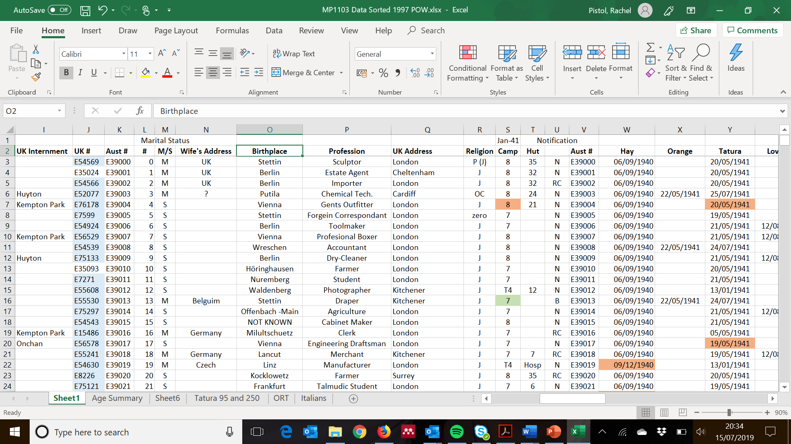

In order to map these locations, the EHRI Entity Matching tool proves
very useful. It is available at <https://emt.ehri-project.eu/>:

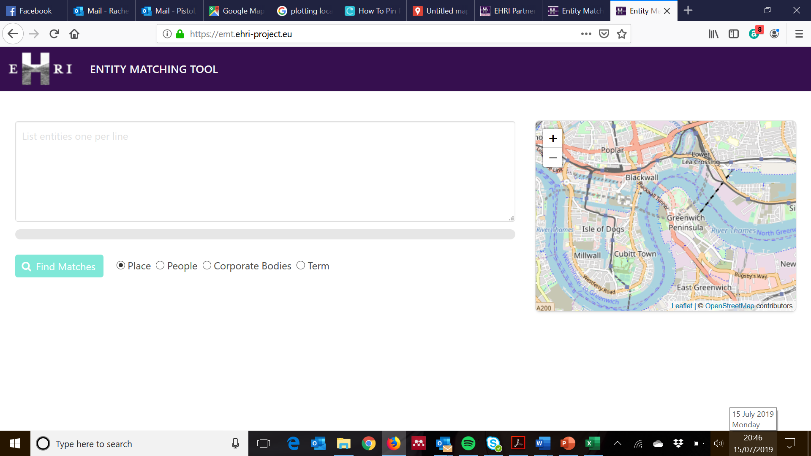

For the purpose of this example, places are used, though it is also
possible to match people, corporate bodies, and terms using this tool.

The cells listing the birthplaces are copied into the entity matching
tool. The tool automatically turns the column of cells into a list of
one entity per line. Click on the ‘Find Matches’ button.

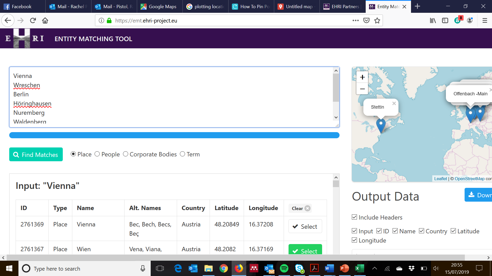

Once ‘Find Matches’ has been clicked, the results appear in a window
below. For each place there is a list of all possible matches. Scroll
through the list and select the appropriate matches for your data. Your
selections will update the map on the right hand side of the screen so
that the selections can be visualised.

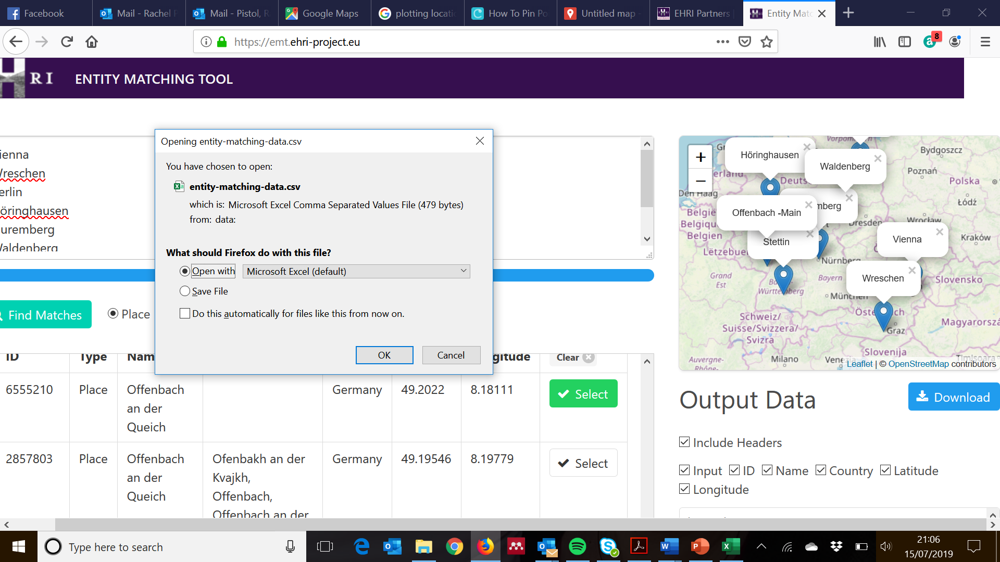

When all selections have been agreed, click on the ‘Download’ button on
the right hand side of the screen, which will give you the option of
opening the file in Microsoft Excel.

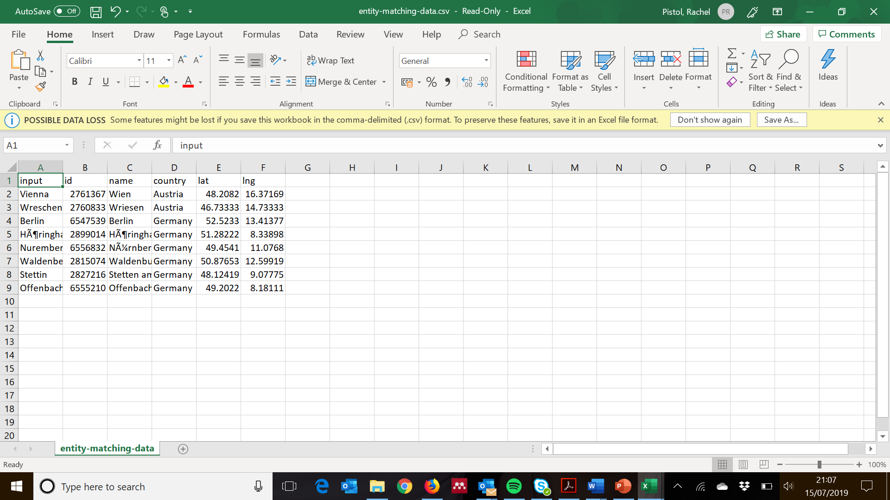

This data can now be used, for example, in creating maps in Google by
going to <https://www.google.com/maps/d/?hl=en>

Click on ‘Create a New Map’ to open a blank canvas.

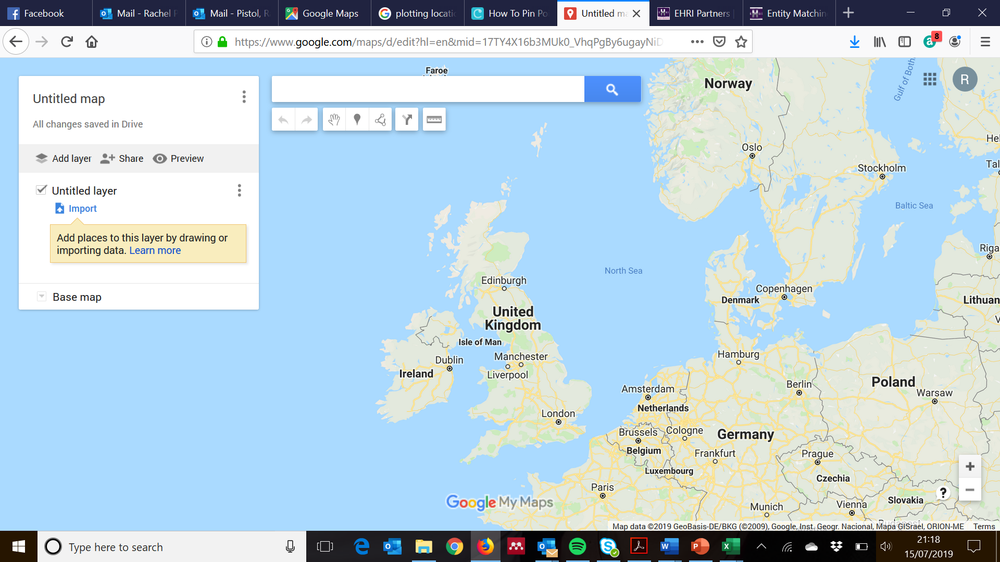

Click on ‘Import’ to add the place data obtained from the entity
matching tools. Select the Excel file downloaded from the entity
matching tool when prompted during the import. The option will then be
given to choose the columns to position placemarks.

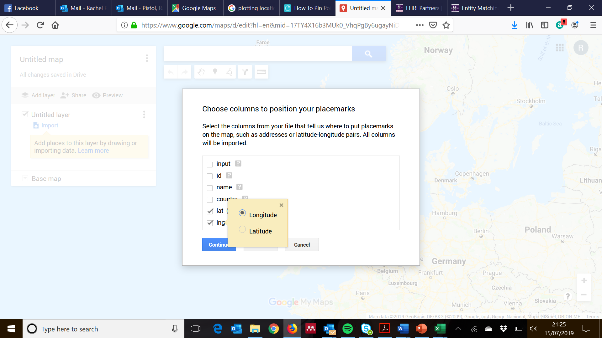

Ensure the latitude and longitude columns are correctly selected to
align with the labels on Google Maps, then click ‘Continue’ and select
the column that holds the names of the places, then click ‘Finish’.

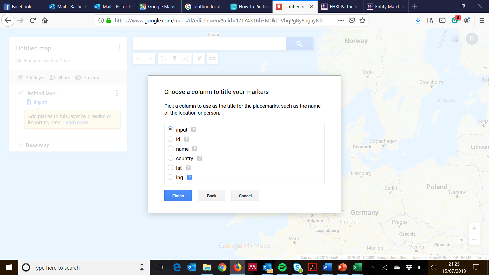

The data can now be visualised on a map as an aid to research, with the
possibility of multiple layers created.

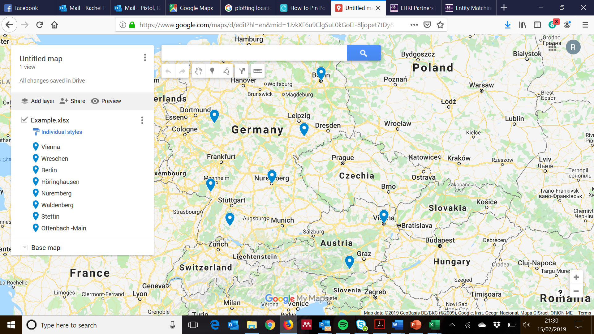

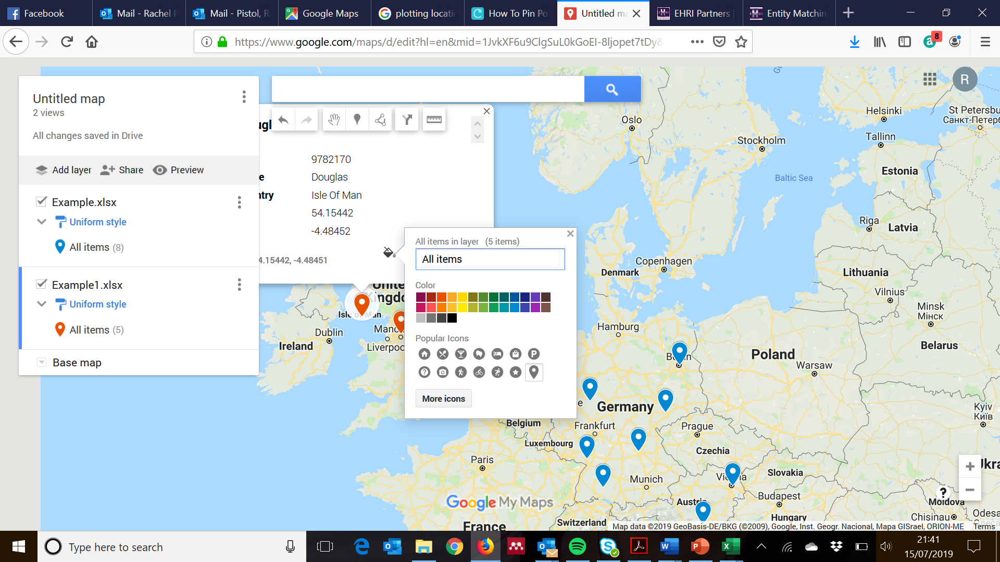

For this particular dataset it was also desirable to show a second set
of location data with the locations of internment camps in the UK. In
order to separate the two set of data, the colour was changed on the
second set by clicking on one of the data points, choosing ‘Edit’, and
clicking on the paint pot icon. Images can also be added to individual
markers, giving further information about the data point, such as
documentation, photos of individuals, or the camps to which they were
sent.

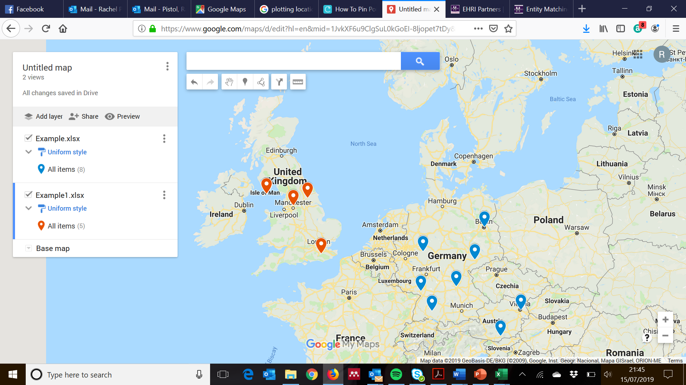

This a simple example of how the EHRI Entity Matching tool can be used
to create data visualisations using mapping tools such as Google Maps,
and there are many variations of how these maps can be created, but
hopefully this short guide will encourage you to experiment with this
digital tool to visualise aspects of your research on refugees and the
Holocaust.
