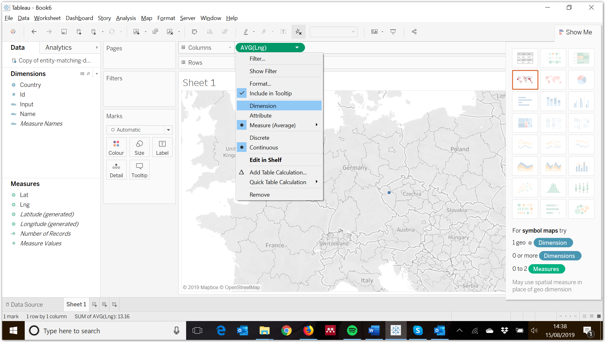
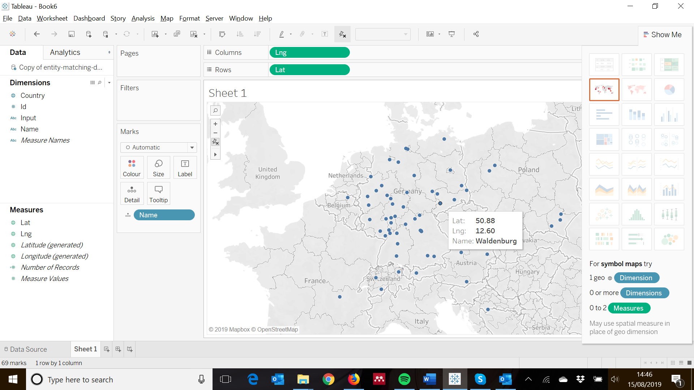
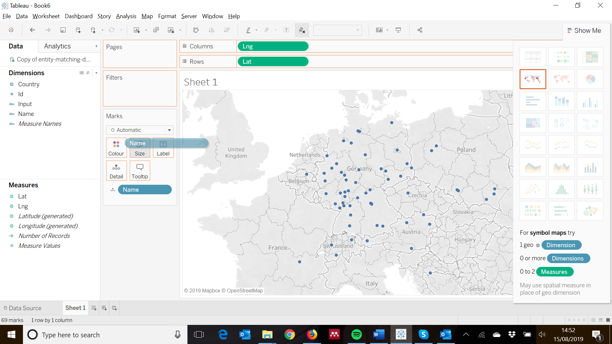
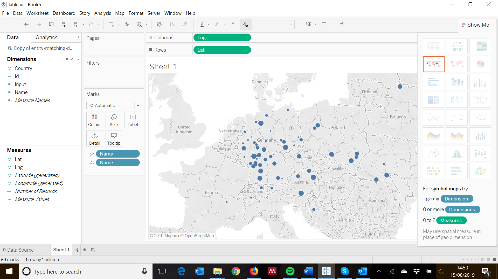
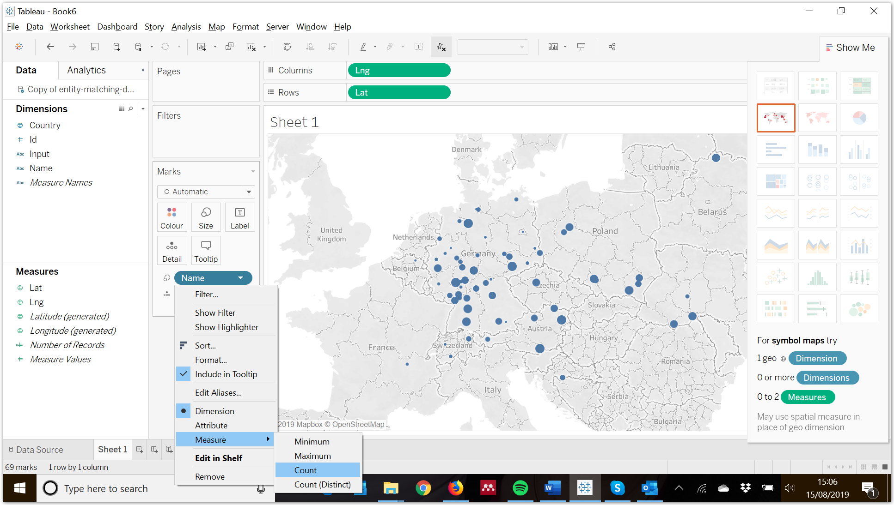
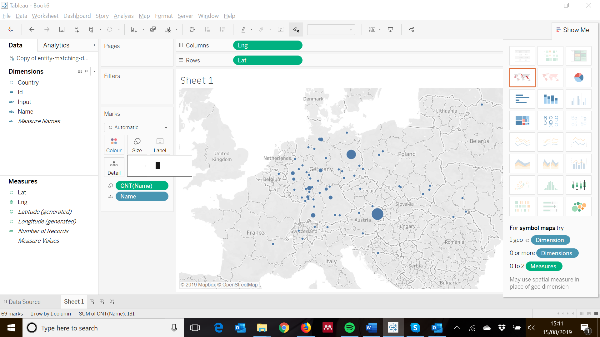

Using spatial data in Tableau
#############################

Tableau is a powerful digital tool for analysing data. In this short
guide we will focus on one particular aspect of data analysis using
mapping that has particular application for Holocaust and refugee
studies. Sometimes just simply mapping your data is not enough, and you
want to use other features such as changing the size of a marker above a
location in order to demonstrate the number of people from that town or
city. Tableau can help with this and can be used for free for 14 days,
or is available free of charge to individuals teaching or researching at
an academic institution. For more information about Tableau and to
download the software see
[*https://www.tableau.com/*](https://www.tableau.com/)

Using Tableau it is possible to import a variety of files. For the
purpose of this guide the example will be based from a .csv file, but
the same principles apply to Excel spreadsheets. Open Tableau and on the
left hand side of the window you’ll see the opportunity to ‘connect’ to
a variety of files, including .csv. This will open a dialogue box that
allows you to select the file from your computer. If your spreadsheet
has multiple sheets, you will need to drag the appropriate sheet from
the left hand side of the screen to the upper part of the main window.
When you are satisfied the correct data has been selected (amendments to
column names etc. can be made by right-clicking at the top of the
column), click on ‘Sheet 1’ in the bottom of the left hand part of the
screen.

In order to create the map you may need to change the classification of
the data for it to be recognised as geographic data. Right click on the
relevant dimension and then select the appropriate category. Tableau can
work with converting some place names to geographical data, but it is
also possible to create your own longitude and latitude coordinates
through using a tool such as the EHRI entity matching tool (see the
guide available at
[*https://github.com/EHRI/ehri-data-analysis-tools/tree/entity\_matching/entity-matching*](https://github.com/EHRI/ehri-data-analysis-tools/tree/entity_matching/entity-matching)).
In this example, the ‘Lat’ column from our spreadsheet has been
classified as a geographic element but the ‘Lng’ has been classified as
a number. To be read as spatial data, right click on ‘Lng’, click on
‘Geographic Role’, and then ‘Longitude’. You will notice the icon next
to ‘Lng’ changes to a lined sphere once you have done this.

Now that both the ‘Lat’ and ‘Lng’ have been assigned geographic roles,
in order to get our data to display on a map we need to drag the ‘Lng’
column from our spreadsheet (under ‘Measures’), and drop in the section
marked ‘Columns’. Then we need to take the ‘Lat’ column (also under
‘Measures’) and drag and drop it in ‘Rows’.

You will notice that Tableau recognises this data should be on a map,
but it has automatically converted the measures of longitude and
latitude into averages and is, therefore, only displaying one data
point. To remove the average function, click on ‘AVG(Lng)’ and change it
to a ‘Dimension’. Do the same for ‘AVG(Lat)’.

Now that ‘Lat’ and ‘Lng’ have become dimensions, all of your data points
should appear. If you hover over one of the markers on the map it will
tell you the latitude and longitude, but it would be more helpful if,
when your cursor moves over a place on the map, it gives you the town or
city name.

To show the names of the town or city on your map, click and drag ‘Name’
from the ‘Dimensions’ menu on the left hand side of the window and drop
on it on ‘Detail’ in the ‘Marks’ window.

The ‘Name’ dimension will now appear with the ‘Detail’ logo in the
‘Marks’ pane, and if you move your cursor across the map the name of the
town or city will appear.

Finally, you may want to demonstrate that there were more individuals
from one town than another. To do this you need to again click and drag
the ‘Name’ dimension from the ‘Dimensions’ menu on the left hand side of
the screen, but this time drop it over ‘Size’ in the ‘Marks’ pane.

This now shows a series of different sized markers, but they are ranked
in terms of size via the alphabet, therefore cities like Berlin appear
much smaller than Wien.

To change the size of the marker to be proportional to the number of
records from the town or city, the ‘Name’ dimension for ‘Size’ needs to
be changed into a measure. There are a variety of different functions
that can be used in measures, and in this case we want to use the
‘count’ function as we wish to count the number of times a town or city
appears in our data. Click on the ‘Name’ dimension in the ‘Marks’ pane
that is linked to ‘Size’, then select ‘Measure’ and ‘Count’.

If you hover above a marker on the map now, you will see how many times
that town or city appears in your data.

Finally, you may wish to change the size of the markers to make the
smaller ones more obvious. To do this click on ‘Size’ in the ‘Marks’
pane and move the slider to the size you desire.

This is only one way that Tableau can be used, but this is a
particularly useful digital tool for researchers working in Holocaust or
refugee related studies.
