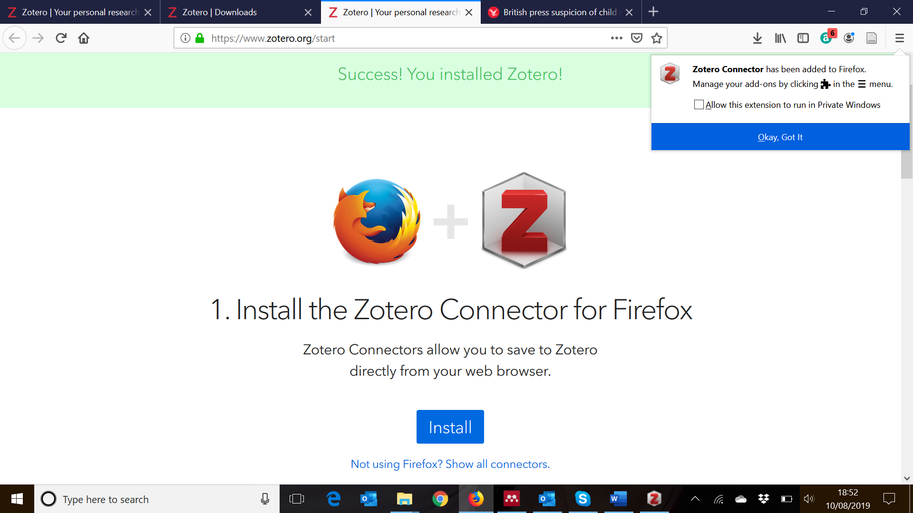
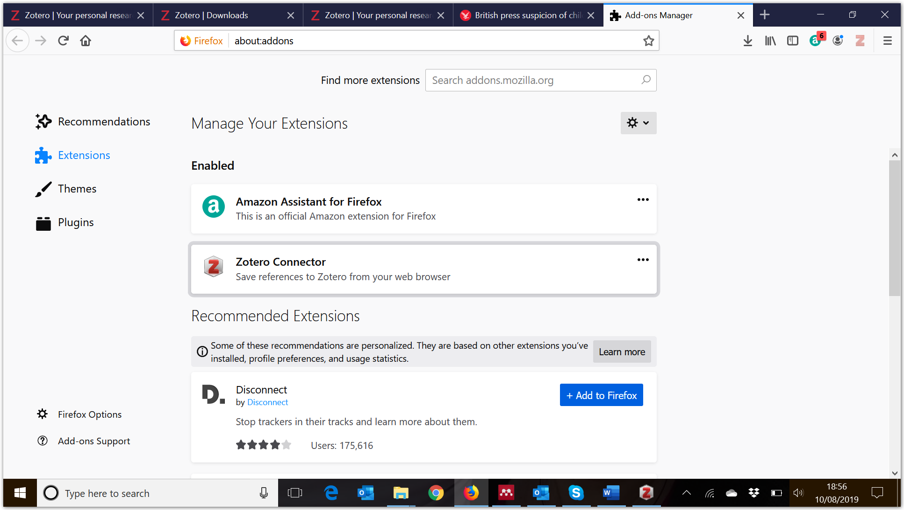
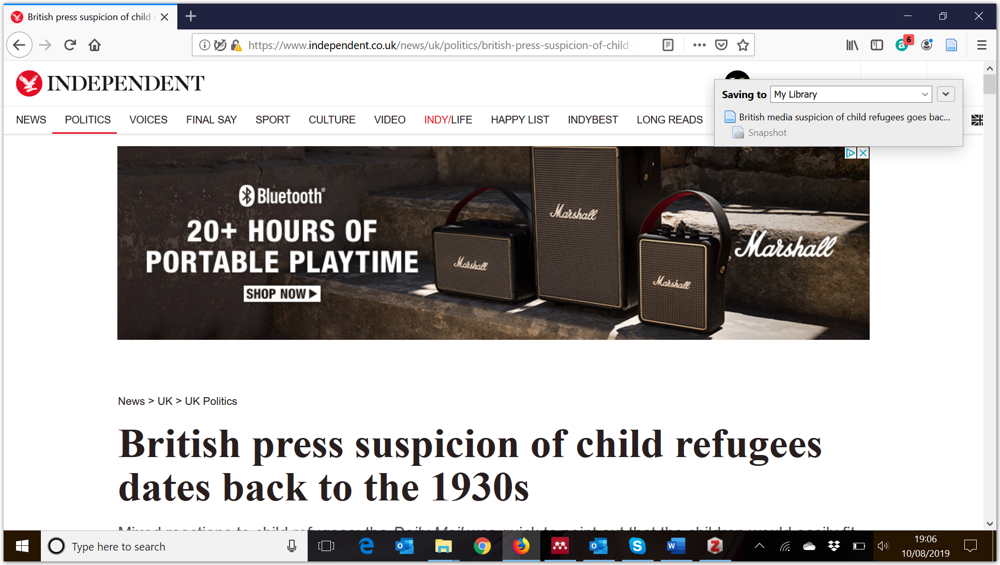
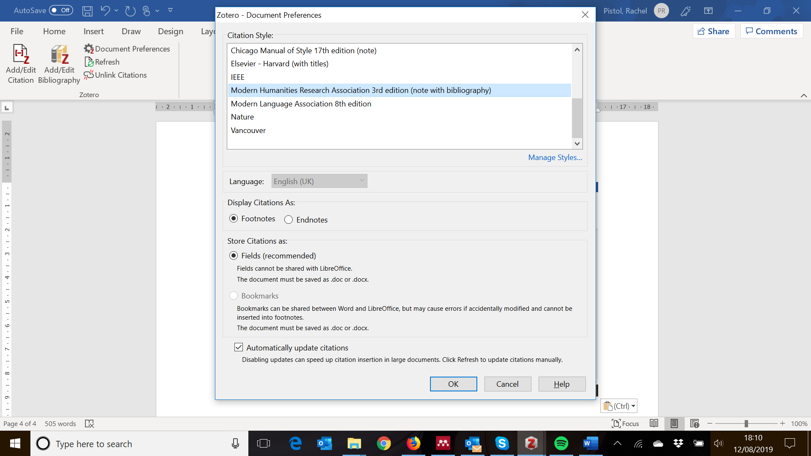

How to capture and reference a webpage in your research using Zotero
====================================================================

The need to reference webpages in academic work is growing all the time,
particularly in the digital humanities. There are many different
reference management systems that exist to help researchers sort and
find their sources and the most accessible of these is Zotero. This
short guide will show how to use Zotero to capture webpages that can
then be cited in your work.

If you have not come across Zotero before, it is an open access tool
that helps you collect, organise, cite and share research. To download
Zotero, go to [*https://www.zotero.org/*](https://www.zotero.org/)

You will need to download both the standalone version as well as the
Zotero connector for your web browser (in this example Firefox). There
are different connectors depending on the web browser you are use.

When you first start using Zotero, the standalone version will be empty
of references. It is possible to import references from other database
sources, or to input your collections manually, or add items from the
web. Your collections can be sorted into different folders to help you
find your data. For more information on how to do this click *here*.

One advantage to using Zotero, particularly in the digital humanities or
in Holocaust research, is that you can capture webpages into your
database with ease. You need to have installed the web connector first.
In this example the browser being used is Firefox. Once installed, you
will see a message highlighting the fact Zotero has been added as an
‘add-on’ and can be managed through the Firefox menu.

If the Zotero add-on button has not appeared on your toolbar, go into
the Firefox add-on manager, click and hold on ‘Zotero Connector’ and
drag and drop it to the toolbar (where your bookmarks and download
buttons are).

Once you have the Zotero add-on button, find the webpage you are
interested in and then click on icon in the top right hand side of your
browser (if using Firefox) to ‘Save to Zotero’. A dialogue box will open
showing where the webpage will be saved.

To change where the item will be saved, click on the downward facing
arrow to the right of ‘My Library’ and make your selection. Then click
‘Done’.

When you open your standalone version of Zotero you will see the webpage
has been added. You can correct the data if necessary. Notes and tags
can also be added, and you will note that if you click on the arrow to
the left of the item you have imported, there is a ‘Snapshot’ of the
webpage, plus the details of when the webpage was accessed (essential
for referencing).

When it comes to cite your work, if you are using a Microsoft Office
program Zotero should have automatically installed as an additional menu
item on the toolbar at the top of the page. If this has not happened
automatically you will need to go into the Zotero standalone version,
click on ‘Tools’, and ‘Add ons’ and install the Zotero add on manually.
From the Zotero tab you can amend the citation style, add citations and
bibliographies etc.

There are many other features of Zotero that can be explored, but in an
age of digital sources this shows how to make capturing information from
the web and using it appropriately for research purposes almost
effortless.
